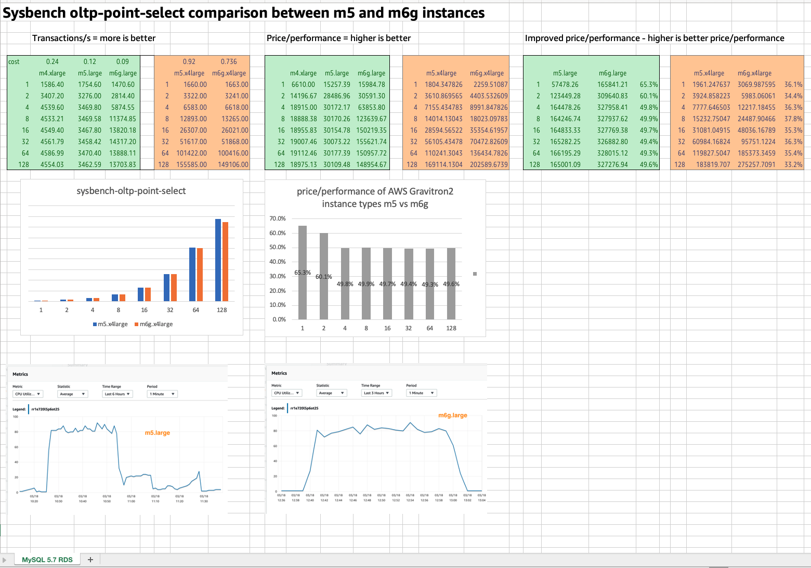

## Getting start with AWS Graviton

Instructions on how to get these demos up and running on your AWS environment.

### 1. AWS Developer tools running on AWS Graviton2 powered instances

As part of this demo, you will get to see how the AWS developer tooling works happily across x86 and aarch64 environments. Whilst for some of these there is no direct/integrated approach to using AWS Graviton2 instances, in the fullness of time we can expect to see that happen.

**AWS Cloud9, AWS CLI, AWS CDK**

At the time of writing, you could not select AWS Graviton instance types when creating AWS Cloud9 development environments.

Until this changes, you can use this cdk app to provision an EC2 instance and then follow these instructions to create an ssh Cloud9 development environment.

Things to be aware of:

* The developer environment will not automatically hibernate, so make sure you stop/start the instances so you are not incurring costs when you are not using the environment
* Some of the integration that is done for you automatically when you spin up a Cloud 9 environment will need to be manually setup by yourself (for example, your AWS credentials)
* This does not configure an external facing EC2 instance, if you need to connect you can use Session Manager and connect as ec2-user

**Pre-Reqs**

- You will need to have a local developer environment that is setup and configured with the aws cli
- You will have installed cdk
- You are running a supported version of Python (>3.7) and the latest pip

**Installation**

Once you have checked out this repo into a local folder, go to the developer-environment folder and install the dependencies

```
$ cd <local source folder>
$ cd developer-environment
$ pip install -r requirements.txt
```

Make sure that the cdk app is ok by issuing the following command, which should output the two cdk stacks that you will create

```
$ cdk ls

c9-vpc
c9-ide
```

If you do not get that, then there is an issue which you will need to resolve before continuing.

You are now ready to deploy your AWS Graviton powered instance. Install the first stack, accepting y for any prompts.

```
$ cdk deploy c9-vpc
```

When that has completed, you should get some output like the following (with your own account details instead of these):

```
 ✅  c9-vpc

Outputs:
c9-vpc.ExportsOutputRefDemoCloud9VPC8871F024014B0437 = vpc-0b71bbf5af816ed31
c9-vpc.ExportsOutputRefDemoCloud9VPCpublicSubnet1Subnet7E5CFDAB950D0894 = subnet-0d9f74a4b2e34b953

Stack ARN:
arn:aws:cloudformation:eu-central-1:XXXXXXXXXX:stack/c9-vpc/9c7c3010-8750-11eb-ba3c-06ccf463d918
```

Install the second stack, again answering y to any prompts.

```
$ cdk deploy c9-ide
```

Once this has completed, your environment is now setup. You can confirm this by going to the AWS console and checking the EC2 instances for the region you configured. You will need to connect to this instance in the next stage.

**Configuration**

From the EC2 console, select the EC2 instance you have just created (the default is called Cloud9, but if you change it in the script it will be whatever you called it)

The first thing you are going to need to do is record the Public IPv4 DNS details for this instance, as we will be using that when we create the Cloud9 ssh environment.

The next thing you need to do is open up a ssh session to this instance. Given we have restricted access, us the Connect > Session Manager to connect. This will connect you as the ssm-user, so we will switch to the user we need

```
$ sudo su - ec2-user
```

Now we need to add the ssh public key into the .ssh/authorized_keys for the Cloud9 environment we are about to create. So lets get ready by going into that directory first

```
$ cd ~/.ssh
```

Now keep this tab open and open a new one (or navigate back) to the AWS Console, and go to the AWS Cloud9 console, using the same region that you created the EC2 instance in.

* Click on CREATE ENVIRONMENT and provide it a name (I am going to use, GravitonC9Demo) and click on NEXT STEPS.
* Select the THIRD option - Create and run in remote server (SSH connection)
* - For "User" enter ec2-user
* - For "Host" enter the Public IPv4 DNS details you saved above (it will be in the format of ec2-{ip}.{region}.compute.amazonaws.com)
* Click on COPY PUBLIC KEY

Now switch to the Session Manager tab, and you will now add this key to the authorized_keys file. 

```
$ echo {paste public key} >  authorized_keys
```
You can check the file to make sure the key has been added.

Now return back to the AWS Cloud9 create screen and click on NEXT STEP. If all is well you will see a REVIEW page, which you can now complete by clicking on CREATE ENVIRONMENT.

If everything has worked, the next screen you see should be the AWS Cloud9 introduction screen. From the terminal, enter the following command to validate that you are running on an AWS Graviton2 powered instance.

```
$ uname -m

aarch64
```

**Post installation**

Once you have access to this, there are a few things you are going to need to do:

1. Configure your aws credentials using the "aws configure" command, which will ensure you can use the aws cli to interact with AWS.
2. Install any additional tools you might want to use - remember that you will need to look for aarch64 versions of those tools, or compile them via source. The build should have the essential tools you need to do this already installed.
3. For some EKS demos later, you can install the kubectl and eksctl tools, both of which run happily on aarch64

```
$ cd
$ curl --silent --location "https://github.com/weaveworks/eksctl/releases/latest/download/eksctl_$(uname -s)_arm64.tar.gz" | tar xz -C /tmp
$ sudo mv /tmp/eksctl /usr/local/bin
$ curl -o kubectl https://amazon-eks.s3.us-west-2.amazonaws.com/1.17.12/2020-11-02/bin/linux/arm64/kubectl
$ chmod +x ./kubectl
$ mkdir -p $HOME/bin && cp ./kubectl $HOME/bin/kubectl && export PATH=$PATH:$HOME/bin
```

You should also set up your git

```
git config --global user.name "{yourname}"
git config --global user.email {youremail}
git config --global credential.helper '!aws codecommit credential-helper $@'
git config --global credential.UseHttpPath true
git config --global init.defaultBranch main
```

### 2. Workload choice

AWS Graviton2 instances provide customers with more choice to run their workloads. When thinking about which workloads might make good candidates, you will probably want to perform some kind of assessment and analysis of your own applications to see how they perform.

There are plenty of benchmarks that have been produced, but these should be used as a starting point only. There is no substitate for doing your own baseline testing, especially if you already have workloads that are integrated into performance tests as part of your CI/CD testing approach.

The aim of this phase is to make sure you have the data you need to make the right workload choices.

**Methodology**

You should leverage your own methodology when it comes to running these tests. As mentioned before, general benchmarks, even benchmarks done by other folk are good general indicators, but you really want to understand what this means for your particular workloads which means coming up with a method for using the tools, the elastic benchmark environment that you can easily spin up in AWS and your application to generate the data to determine the level of price/performance improvements you are likely to see.

Once you have your data, you then need to work out the price/performance. For the MySQL benchmark using sysbench it is a simple calculation, where I use the transactions/per second as my metric (with higher being better). Yours may differ.

* For benchmark data where higher numbers are better, take the source metric and divide it by the on demand cost for the instance type you used during that benchmark
* For benchmark data where lower numbers are better, take the source metric and multiply it by the on demand cost for the instance type used during the benchmark

This will give you the relative price/performance difference, so even if one of the actual source metrics performes about the same, once you have factored in the lower costs of AWS Graviton2 instance types, then you can present the difference.

Make sure you think about how you capture the system information during the benchmark process - you want to capture the system characteristics (cpu, io, memory, etc) so that you can compare how running the workloads changes. Depending on your results, you might iterate and dive deep here, using application profiling tools for example to create flame graphs to see where there are optimisations or bottlenecks as part of the tests



**Tools**

There are plenty of open source tools to help you benchmark your tools. Here are just some of the ones I have used:

- JMeter - you can created quite sophisticated tests via the gui, and then run these headless via a number of loaddrivers
- Apache ab - a good general purpose and easy to get started load driver
- Sysbench - a good tool for load testing databases

Finally you should look to script and make reproducable your benchmarking work so you can reproduce the results, baseline them over time and keep on top of this.

I have provided within the benchmarking folder a cdk app that deploys a number of services that you can use that creates tools that you could use as a basis for benchmarking. A number of tools has been deployed and configured and are ready to go, to make it easy for you.

### 3. Supporting multi architecture workloads

There are two sample applications, one written in C and the other a Java Spring Boot app. We can get these up and running locally using the following commands.

To run the C demo in your local VSCode or terminal

```
$ cd sample-apps\c-demo\local
$ gcc "-DARCH=\"`uname -i`\"" hello-graviton.c -o hello
$ ./hello
```
If you prefer to use docker you can use the dockerfile.

```
$ cd sample-apps\c-demo\docker-c
$ docker build -t demo .
$ sudo docker run demo
```

Either way, both of these should give you output like this

```
 === DevDay === 

Hello, architecture from uname is aarch64
64-bit userspace
```
To clean up and remove the image, use "$sudo docker image rm demo"

To run the Java Springbook locally, you will need to have an OpenJDK 11 or later JDK running.

```
$ cd sample-apps\springboot-demo\
$ ./mvnw package
$ ./mvnw spring-boot:run
```
And if you open a browser and go to http://localhost:8080 you should see something like this:

**Immutable images - using EC2 Image Builder to build multi arch images**

This demo code shows how you can setup a CI/CD pipeline to create immutable AMI images from source code. The demo creates a build pipeline that a)builds your application and creates application artifacts, b)uses those as inputs to building an AMI using the EC2 Image Builder, before c)deploying that to an auto-scaling set.

The demo creats multiple pipelines which allow you to create multi architecture AMIs for your application. From a single source code commit, you can create x86 and arm based AMIs which you can then use across any AWS instance type. Perfect to provide you with the choice for running your applications on the best workload.

To build this demo yourself, you need to do the following

Edit the deploy.sh file and define some unique S3 buckets. The run the command to kick off the creation of the two pipelines.

```
$ . ./deploy.sh
```

This will take around 30-45 minutes to complete, but you can keep an eye on the cloudformation screen and watch out for and resolve any issues/errors that might occur. This project will deploy the following: AWS CodeCommit repositories for x86/arm, Build pipelines for x86/arm and a deployment pipeline that uses EC2 Image Builder. A Lambda function is created that provides macros used within the Cloudformation template.

The initial setup will create these environments that are identical, except that one uses an x86 and the other uses an arm based architecture.

Once this is working, you should create another CodeCommit (or GitHub or something you use) repo, and then link these to both the pipelines. When you do this, when you create a change, it will kick off the pipeline and create both x86 and arm based builds that will create new AMI images and then update the auto scaling deployment set.

Once you have deployed these, to view the app you have a couple of options:

* The first is to create an application load balancer that maps incoming port 80 to the target port of 8080 that the Spring Boot application is listening on. You can now access the application via a browser, using the application load balancer DNS name. 
* The second is to just open the ingres port on the security group on port 8080, limit it to your IP address. You can now access the application via a browser, using the EC2 DNS name, but appending port 8080 to the URL.

You can experiment making some changes to the code and kicking off builds to see how this works and how you might be able to use this as a base for creating your own multi-arch image builds.

**Multi arch container**

In the next demo we will create multi architecture containers for our sample C application.

Create a CodeCommit repo and commit the contents of the repo folder into this repo. You will need to update the cdk app to point to this repo.

Once you have done that, use cdk to deploy the application. Before deploying however, make sure you update the base.py and pipeline.py to reflect:

* the name of the codecommit repo you are using
* the aws account and region you are deploying this into

You will need to update the hello-world.yaml with the details of the Amazon ECR image repository that gets created as part of the deployment (this is by default the same name as the stack you have created, i.e. demo-graviton-multi-arch)

```
$ cdk ls
$ cdk deploy demo-graviton-multi-arch-base
$ cdk deploy demo-graviton-multi-arch-pipeline
```
Once the pipeline has run, it will create images in Amazon ECR which you can then run. You can view more info on these images by using these cli commands - I am using the default Amazon ECR repo name from the code, so change it if you have used something different:

```
$ aws ecr describe-repositories --repository-names {demo-graviton-multi-arch}
$ aws ecr describe-images --repository-name {demo-graviton-multi-arch}
```

You can now run the images either locally on your developer setup if you have Docker running, or anywhere you run Docker. Try it on x86 and arm based systems to see what output you get. To run them use these commands:

```
$ aws ecr get-login --no-include-email --region {aws region}
```
the output you get from this command should be run in the terminal, which will generate a login token that is valid for a short period of time. Then run this command to run the container.

```
$ docker run  {your AWS account}.dkr.ecr.{aws region}.amazonaws.com/{Amazon ECR image - .i.e.demo-graviton-multi-arch}:latest
```

If it all goes well, it should start downloading the image locally and then output the following

```
 === DevDay === 

Hello, architecture from uname is x86_64
 Version 1.0

64-bit userspace
```

When I run it from the AWS Graviton2 powered Cloud9 environment, I get the following:

```
 === DevDay === 

Hello, architecture from uname is aarch64
 Version 1.0

64-bit userspace
```

I can now run my app on all AWS instance types!

Make changes to the code, for example add a new line, or change the version number, commit the code and then this will kick off the pipeline and create new images. You can now run specific versions of these images, or just used :latest to get the latest versions. To run these, use the following commands:

```
$ docker pull  {your AWS account}.dkr.ecr.{aws region}.amazonaws.com/{Amazon ECR image - .i.e.demo-graviton-multi-arch}:latest
$ docker run  {your AWS account}.dkr.ecr.{aws region}.amazonaws.com/{Amazon ECR image - .i.e.demo-graviton-multi-arch}:latest
```
You should now see the latest version and see the modifications you made.

Now you have the container, why not try running them in an Amazon EKS cluster, and even better than that, why not try running it in some managed node clusters with x86 and arm based instances.

Review the [deploy.md](deploy/deploy.md) file for details of the commands you can use to do this.

To clean up the environment, just issue the following commands:

```
$ cdk destroy demo-graviton-multi-arch-pipeline
$ cdk destroy demo-graviton-multi-arch-base
```
You might also have to manually remove the Amazon ECR repository if you created it as part of this demo. The CDK script does not remove that.

**Multi arch container - SpringBoot**

One final demo which shows the end to end CI/CD pipeline that allows you to deploy tour sample Springboot application to an Amazon EKS cluster running mixed x86 and arm nodes.

First step up credentials for Docker Hub which you will store securely in AWS System Parameter Store. You will need to create the following in the region you are deploying, using values for a valid DockerHub account as values:

```
/springboot-multiarch/dockerhub/username
/springboot-multiarch/dockerhub/password
```

You will need to change to the cdk directory and then deploy the backend stack first.

```
cdk deploy demo-multi-arch-springb-backend
```

Once this has completed (it might take 30-40 mins), you can deploy the pipeline, which should take a lot less time.

```
cdk deploy demo-multi-arch-springb-pipeline
```

Once you have done that, check out the empty repository that has been created (if using defaults, it will be demo-multiarch-springboot-multiarch). Copy the contents of the master-demo-spring-app into this folder and then commit this change to the repo. 

> 
> Note!Once thing to check, the default branch should be set to main. If you used the settings above, you should have this set. If your pipeline fails, it might be due to the default branch still looking for master. You will need to fix that before the pipeline will work.
>

Once the pipeline has started, it might take around 10-15 minutes for it to complete. Once it has completed, you need to go to the Cloudformation stack and copy/paste the kubectl commands that will authenticate you on your developer environment.

You can now run kubectl commands against this cluster, to get the external url we issue the following command

```
$ kubectl describe ingress | grep Address 
```

You can now use the URL to access the load balanced Springboot demo application. Every time you refresh, you will see a different architecture - try it several times to see that happen.

If you now make a change to the source code - you can edit the file in the CodeCommit repository page - this will trigger a rebuild/redeployment and you should see the application update automatically. The process should take around 5-10 minutes to complete.

To clean up and remove the demo

```
cdk destroy demo-multi-arch-springb-pipeline
cdk destroy demo-multi-arch-springb-backend
```

> Note! I did find that I had to manually delete the following resources after this process. You might find the second destroy eventually fails. If that happens, you can manually delete the Amazon ECR repository that was created, remove the Application Loadbalancer and then remove the VPC that was created. All these resource names are identified via the CloudFormation stack resources tab.
